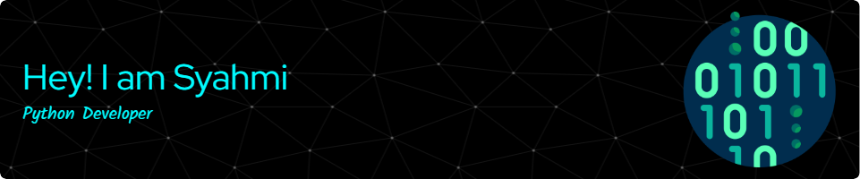

  

<h1 align="center">Welcome to mi page! </h1>

  

---

<ul>What is going through my <b>head</b> 🧠:
  
    
  <li>🕵🏻‍♂️ I'm still <b>learning</b> how to <b>code</b>.</li>
  <li>👨🏻‍💻 <b>Build</b> a few <b>projects</b>.</li>
  <li>👾 Is it possible for me to <b>work</b> in <b>coding</b>?</li>
</ul>

      

---

<h3 align="center">Link 🔗</h3>

   &nbsp
   &nbsp
   &nbsp
   &nbsp

  

---

<h3 align="center">Learning 📘</h3>

   &nbsp
   &nbsp
   &nbsp
   &nbsp

      

  

 

  

  

